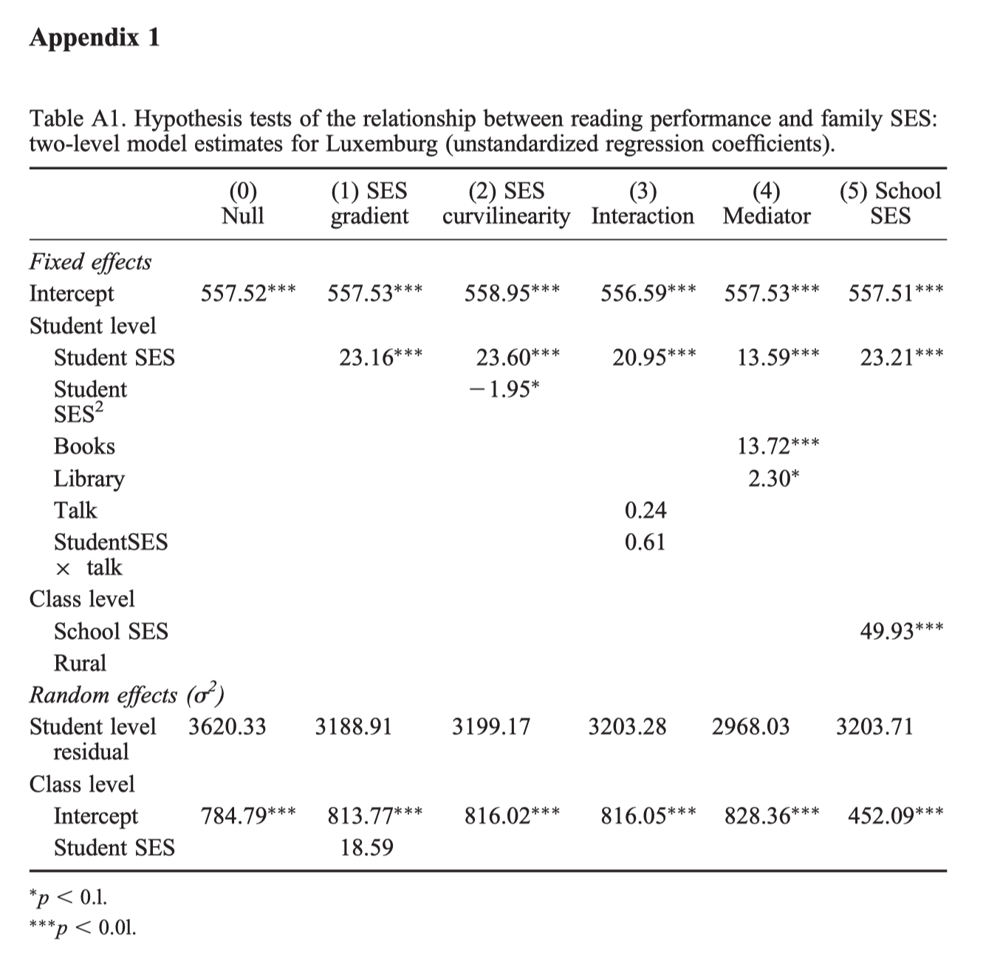
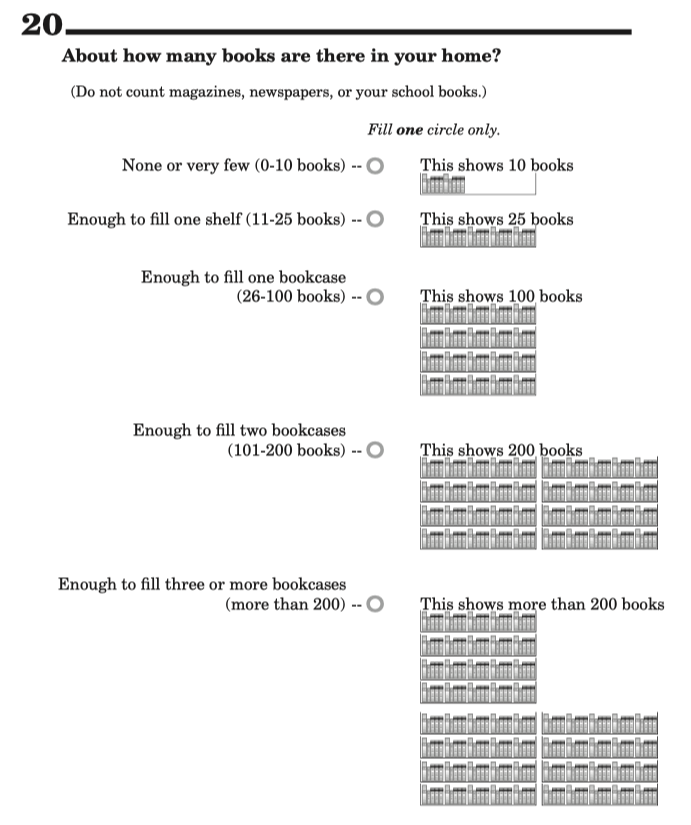
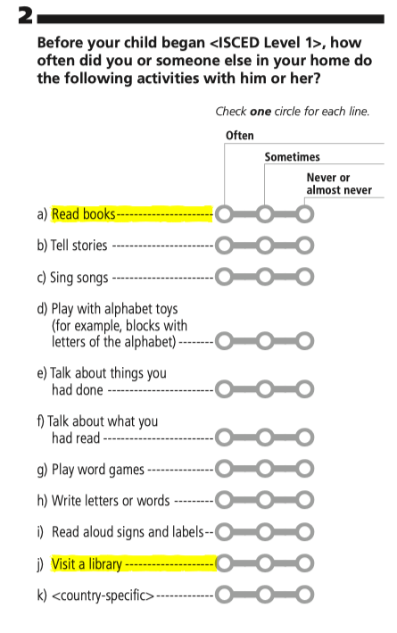

```{r setup, include=FALSE}
knitr::opts_chunk$set(dpi=300,fig.width=7)
```

## Datos

En esta guía de códigos, se emplean el archivo de datos: `data_lux.rds`. Este archivo contiene observaciones de Luxemburgo, del estudio PIRLS 2006. Este estudio, llamado 'Progress in International Reading Literacy Study (PIRLS)' incluye una muestra representiva de escuelas, siguiendo un diseño estratificado. Al interior de cada escuela, se selecciona una sala de clases al azar. En este estudio participan estudiantes de cuarto grado, de 9.5 años de edad aproximadamente, con 4 años de escolaridad. Las variables que contiene este archivo se describen en la Tabla 1.

```{r echo=FALSE}

#------------------------------------------------------------------------------
# open data
#------------------------------------------------------------------------------

library(dplyr)
data_lux <- readRDS('data_lux.rds')

#--------------------------------------
# display data structure
#--------------------------------------

r4sda::variables_table(data_lux) %>%
knitr::kable(caption = 'Tabla 1: Datos Luxemburgo (PIRLS 2006)')

```

En Anexos, se incluye un detalle mayor respecto a cada una de las variables incluídas.

>**Advertencia**: En el presente taller, solo se incluyen aquellas observaciones que no presentan datos perdidos entre las variables seleccionadas. Además, los datos originales poseen un diseño muestral particular, el cual no es integrado en la estimaciones presentes en este taller. Adicionalmente, los resultados presentes solo emplean el primer valor plausible de la "habilidad de comprensión lectora" evaluada por el estudio. Por tanto, los resultados generados no reproducen los resultados presentes en los informes internacionales de PIRLS 2006 y PIRLS 2016. Esta omisión, se realiza para poder enfocarnos en la práctica general de ajustar modelos múltinivel. Para más detalles de las condiseraciones a tener sobre este tipo de datos, llamados en general estudios de gran escala (i.e. *large scale assessment*) ver Rutkowski et al (2010).

**Referencias**

>Rutkowski, L., Gonzalez, E., Joncas, M., & von Davier, M. (2010). International Large-Scale Assessment Data: Issues in Secondary Analysis and Reporting. Educational Researcher, 39(2), 142–151. https://doi.org/10.3102/0013189X10363170

# Ejercicio desarrollado

El primer ejercicio de esta guía consiste en replicar la Tabla A1 presente en Caro & Lenkeit (2012). Esta tabla, contiene una secuencia de seis modelos (ver Figura 1), los cuales nos sirven para ilustrar los diferentes pasos más comunes en la práctica de ajustar modelos multinivel a datos educacionales. 


```{r echo=FALSE, out.width = '80%', fig.cap = 'Figura 1: copia de Table A1'}



```

De esta tabla, en este ejercicio, vamos a generar los modelos 0, 1, 2, 4 y 5.

En general, la práctica de ajustar modelos incluye al menos 5 pasos:

- abrir los datos
- preparar los datos
- ajustar modelos
- sintetizar resultados
- describir los resultados

**Abrir los datos** consiste leer los datos, de alguna forma, en el entorno estadístico en el que se esté trabajando. En nuestro caso, estamos empleando el entorno `R`, y como tal necesitamos abrir los datos en este entorno para trabajar con los datos de interés.

**Preparar los datos** consiste en alterar los datos originales, para adaptarlos a los propósitos de nuestras de preguntas de investigación. En este paso se crean variables nuevas, a partir de las variables originales, para que sea más fácil ajustar los modelos seleccionados. Este paso incluye rutinas tales como: renombrar variables, recodificar variables, centrar variables, unir datos, re-estructurar datos, entre otras modificaciones posibles.

**Ajustar modelos** consiste en especificar alguna relación particular entre variables, en algun entorno de estimación. Este paso puede incluir modelos tales como regresiones, regresiones logísticas, modelos mixtos, ecuaciones estructurales, u otro tipo de modelos. En el presente ejercicio, vamos a especificar al menos seis modelos diferentes para replicar la Tabla A1.

**Sintetizar resultados** consiste en generar tablas y/o gráficos que nos permiten leer los resultados de forma ordenada. La idea general, es evitar tener que leer todos los output originales uno a uno. En cambio, la idea es producir alguna forma de presentación de resultados que condense la información obtenida para presentar los resultados a un lector. En el presente ejercicio, nos centraremos en la generación de una tabla de resultados.

**Describir los resultadoss** esta etapa consiste en describrir en palabras los resultados encontrados. En este ejercicio, emplearemos el formato de descripción de resultados comúnmente empleado en articulos de investigación y *journals*.


## 1. Abrir datos

Los datos del presente taller se encuentran en formato `.rds`. Este tipo de archivos se pueden leer con la función `readRDS()`, y ser asigandos a un objeto cualquiera. Es decir que nosotros, los usuarios, asignamos un nombre en la sesión de `R` a la tabla de datos que queremos abrir. Adicionalmente, emplearemos la función `dplyr::glimpse()` para ver los datos cargados en sesión.

**Código 01: abrir datos**

```{r echo=TRUE}

#------------------------------------------------------------------------------
# open data
#------------------------------------------------------------------------------

#--------------------------------------
# load data
#--------------------------------------

library(dplyr)
data_lux <- readRDS('data_lux.rds')

#--------------------------------------
# inspect data
#--------------------------------------

dplyr::glimpse(data_lux)


```


## 2. Preparar datos

Para reproducir la Tabla A1, necesitamos una serie de variables que no se encuentran en la base de datos original. Estas variables son las siguientes:

- **Student SES**: esta variable contiene las desviaciones del nivel socioecónomico de los estudiantes, con respecto a la escuela de la cual es miembro. Esto quiere decir, que esta variable se encuentra centrada a los clusters (i.e. *centering within cluster*) (ver Enders & Tofighi, 2007). Esto puede ser expresado con la siguiente ecuación:

$$\text{Student SES} = ses_{ij} - \bar{ses_{.j}}$$

Lo anterior quiere decir que, necesitamos restarle a `ses` las medias de cada escuela, para poder crear las desviaciones de nivel socioeconómico de cada estudiante, con respecto al resto de sus pares de la misma escuela.

- **Students $\text{SES}^2$**: esta variable es el término cuadrático de la variable anterior. Es decir, que es la variable anterior mutiplicada por si misma. Esto puede ser expresado de la siguiente forma:

$$(ses_{ij} - \bar{ses_{.j}})^2$$

- **$\text{Books}$**: esta variable registra la cantidad de libros en el hogar. Se presumen que esta fue incluido por los autores, como una covariable de nivel 1, y por tanto que se encuentra centrada a la media de las escuelas. De esta forma, la variable icluida en el modelo, puede ser expresada de la siguiente forma:

$$books_{ij} - \bar{books_{.j}}$$

- **Library**: La siguiente variable registra si los estudiantes visitaron librerias antes de integresar a la escuela. Al igual que la variable anterior, creemos que esta variable fue ingresada al modelo como una covariable de nivel 1. Por tanto, asumimos que se encuentra centrada a la media de las escuelas:

$$library_{ij} - \bar{library_{.j}}$$


- **School SES**: esta variable contiene las medias Nivel Socioeconómico de las escuelas. Como es una covariable de nivel dos, debe ser el promedio de SES de las escuelas, centradas a la gran media de la distribución de SES.

$$\bar{ses_{.j}} - \bar{ses_{..}}$$

Para lograr reproducir la Tabla A1, vamos a producir una serie de transformaciones con cada una de las covariables que poseen puntajes a nivel del estudiante. La secuencia de transformaciones, se describen a continuación con la variable `ses_irt`. Sin embargo, vamos a proceder de la misma forma con otras las variables `books`, `library` y `read`. Esto de se describe en el **Código 02**. La secuencia de transformaciones en cuestión la podemos describir con las siguientes ecuaciones:

- $\text{ses_c} = \bar{ses_{.j}}$: las medias de las escuelas
- $\text{ses_g} = \bar{ses_{..}}$: la gran media de la variable de interés
- $\text{ses_m} = ses_{ij} - \bar{ses_{..}}$: vamos a centrar `ses` a la gran media
- $\text{ses_b} = \bar{ses_{.j}} - \bar{ses_{..}}$: las medias de las escuelas, centradas a la gran media
- $\text{ses_w} = ses_{ij} - \bar{ses_{.j}}$: y vamos a centrar `ses` a las medias de las escuelas
- $\text{ses_g} = (ses_{ij} - \bar{ses_{.j}})^2$: y finalmente, necesitamos el cuadrado de `ses` centrado a la media de las escuelas


Aplicar esta secuencia de transformaciones, nos permitirá tener cualquiera de las variables que necesitemos, en su forma original y en sus diferentes versiones de centrado. Para producir las variables anteriores, emplearemos las siguientes lineas código.

**Código 02: preparar datos**

```{r echo=TRUE}

#------------------------------------------------------------------------------
# prepare data
#------------------------------------------------------------------------------

#--------------------------------------
# centering variables
#--------------------------------------

data_lux <- data_lux %>%
            # socioeconomic status
            mutate(ses_raw = ses_irt) %>%                   # copy of the original variable
            mutate(ses   = r4sda::z_score(ses_irt)) %>%     # variable is standardized
            mutate(ses_c = r4sda::c_mean(ses, id_j)) %>%    # means by cluster
            mutate(ses_g = r4sda::c_mean(ses, ctry)) %>%    # grand mean  
            mutate(ses_m = ses-ses_g)%>%                    # centered to the grand mean
            mutate(ses_b = ses_c-ses_g) %>%                 # school means (cgm)
            mutate(ses_w = ses_m-ses_b)%>%                  # centered within cluster
            mutate(ses_q = ses_w*ses_w) %>%                 # square
            # books at home
            mutate(boo_raw = books) %>%                     # copy of the original variable
            mutate(boo   = r4sda::z_score(books)) %>%       # variable is standardized
            mutate(boo_c = r4sda::c_mean(boo, id_j)) %>%    # means by cluster
            mutate(boo_g = r4sda::c_mean(boo, ctry)) %>%    # grand mean  
            mutate(boo_m = boo-boo_g)%>%                    # centered to the grand mean
            mutate(boo_b = boo_c-boo_g) %>%                 # school means (cgm)
            mutate(boo_w = boo_m-boo_b)%>%                  # centered within cluster
            # take children to library
            mutate(lib_raw = library) %>%                   # copy of the original variable
            mutate(lib   = r4sda::z_score(library)) %>%     # variable is standardized
            mutate(lib_c = r4sda::c_mean(lib, id_j)) %>%    # means by cluster
            mutate(lib_g = r4sda::c_mean(lib, ctry)) %>%    # grand mean  
            mutate(lib_m = lib-lib_g) %>%                   # centered to the grand mean
            mutate(lib_b = lib_c-lib_g) %>%                 # school means (cgm)
            mutate(lib_w = lib_m-lib_b) %>%                 # centered within cluster   
            # read to children
            mutate(rea_raw = read) %>%                      # copy of the original variable
            mutate(rea   = r4sda::z_score(read)) %>%        # variable is standardized
            mutate(rea_c = r4sda::c_mean(rea, id_j)) %>%    # means by cluster
            mutate(rea_g = r4sda::c_mean(rea, ctry)) %>%    # grand mean  
            mutate(rea_m = rea-rea_g) %>%                   # centered to the grand mean
            mutate(rea_b = rea_c-rea_g) %>%                 # school means (cgm)
            mutate(rea_w = rea_m-rea_b)                     # centered within cluster

```

Ahora, vamos a revisar las variables creadas. Primero vamos a asegurarnos que fueron incluidas en la tabla de datos que estamos ocupando. Luego, revisaremos que las variables se encuentren centradas, y para esto vamos cerciorarnos de que sus medias descriptivas sean cero. Finalmente, emplearemos una prueba algebraica para revisar que las variables se encuentran debidamente centradas.


**Código 02.1: revisión de centrados**

```{r echo=TRUE}

#--------------------------------------
# check if created variables are in frame
#--------------------------------------

data_lux %>%
r4sda::variables_table() %>%
dplyr::select(-labels) %>%
knitr::kable(., digits = 2)


#--------------------------------------
# check centering with descriptives
#--------------------------------------

data_lux %>%
dplyr::select(ses_raw, ses, ses_w, ses_b) %>%
r4sda::get_desc() %>%
knitr::kable(., digits = 2)

# Note: centered variables should have a mean of zero.

#--------------------------------------
# check centering via decompositions
#--------------------------------------

data_lux %>%
mutate(target = ses) %>%
mutate(proof  = ses_w + ses_b + ses_g) %>%
dplyr::select(target, proof) %>%
unique() %>%
dplyr::sample_n(10) %>%
arrange(target) %>%
knitr::kable()

# Note: target and proof variable, should have equal values.

```

**Referencias**

>Nota: para mayores detalles acerca del centrado ver Enders & Tofighi (2007).

>Enders, C. K., & Tofighi, D. (2007). Centering predictor variables in cross-sectional multilevel models: a new look at an old issue. Psychological Methods, 12(2), 121–138. https://doi.org/10.1037/1082-989X.12.2.121


## 3. Ajustar Modelos

Para ajustar la secuencia de modelos incluidos en la **Table A1**, necesitamos escribir cinco ecuaciones diferentes. Estas ecuaciones, son las siguientes:

- **Modelo Null:** Este modelo usualmente recibe el nombre de modelo nulo, porque no incluye predictores. Pero tambien recibe otros nombres como **variance component model**, porque estima dos componentes de varianza, o **unconditional means** porque es un modelo que genera las medias de las escuelas (Scott, Shrout, & Weinberg, 2013). Este modelo consiste en solo ajustar el intercepto aleatorio de los puntajes de la variable de interés. En términos de ecuaciones, siguiendo la notación de Scott y colegas (Scott, Shrout, & Weinberg, 2013) este modelo se puede expresar de la siguiente manera:

$$y_{ij} = \beta_{0} + u_{0j} + \varepsilon_{ij}$$

Para los datos que vamos a emplear, podemos escribir esta ecuación de la siguiente forma:

- `f00 <- as.formula('score ~ 1 + (1 | id_j)')`

- **Modelo 1 - SES gradient:** Este modelo expresa la primera hipótesis incluída en Caro & Lenkeit (2012), acerca de las brechas de nivel socioeconómico. La expectativa, es aquellos estudiantes de mayor nivel socioeconómico, presentarán mejores resultados que sus pares. Consecuentemente, esto implica que aquellos estudiantes de families de menores niveles socioeconómicos de la población obtendrían peores resultados que el resto de sus pares. Esta relación entre `score` y `ses_w`, queda expresada en el coeficiente $\beta_{1}$ de la siguiente ecuación. Adicionalmente, este coeficiente, tambien es aleatorio. Lo que significa que se estima la relación entre `score` y `ses_w` para cada una de las escuelas presentes en el estudio. Y por tanto, $\beta_{1}$ captura el promedio de estas relaciones entre escuelas. Por su parte $u_{1j}\text{ses_{ij}}$ expresa la varibilidad alrededor del coeficiente $\beta_{1}$.

$$y_{ij} = \beta_{0} + \beta_{1}\text{ses}_{ij} + u_{0j} + u_{1j}\text{ses}_{ij} + \varepsilon_{ij}$$


La ecuación anterior, la podemos expresar con el siguiente código.

- `f01 <- as.formula('score ~ 1 + ses_w + (ses_w | id_j)')`

Esta especificacion en `R`, ademas incluye de forma implicita la covarianza entre los términos $u_{0j}$ y $u_{1j}$. Esto quiere decir, que nos entrega la correlacion entre los interceptos aleatorios, y los coeficientes aleatorios (. Esto puede ser expresado formalmente de la siguiente forma (ver Scott et al., 2013, p. 28):

$G = \oplus_{j} \begin{pmatrix}\tau_{00} & \tau_{01} \\ \tau_{01} & \tau_{11} \\ \end{pmatrix}$

$\tau_00$ es la varianza del término $u_{0j}$, es decir el grado de variabilidad del intercepto aleatorio. Por su parte, $\tau_11$ es la varianza de $u_{0j}$, es decir el grado de variabilidad del coeficiente aleatorio de `ses_w`. Finalmente, $\tau_01$, es la covarianza entre estos efectos aleatorios anteriores.

Si quisieramos, solo incluir el efecto aleatorio de `ses_w`, y suprimir esta covarianza, el código puede ser escrito de la siguiente forma.

- `f01 <- as.formula('score ~ 1 + ses_w + (ses_w || id_j)')`

... o alternativamente, puede ser escrito de la siguiente forma

- `f01 <- as.formula('score ~ 1 + ses_w + (0 + ses_w | id_j) + (1|id_j)')`

En ambos casos, la matriz de covarianzas del modelo especifcado sería la siguiente

$G = \oplus_{j} \begin{pmatrix}\tau_{00} & 0 \\ 0 & \tau_{11} \\ \end{pmatrix}$

> **Nota:** Snijder & Bosker (2012) plantean que forzar a $\tau_{01}$ a cero es un práctica que requiere justificación, y que en la mayoría de los casos, esta covarianza requiere ser estimada e incluida en el modelo. El tamaño de la varianza de $\tau_{00}$, depende del cero de la covariable `ses_w` y lo mismo sucede con $\tau_{10} = cov(u_{0j},u_{1j})$. En el modelo presente, estamos estimando la variabilidad de las medias de las escuelas, al promedio de nivel socioeconómico de la población. Esto es de especial importancia en modelos longitudinales, donde el centro puede ser definido como el inicio del periodo de observación, el centro del período de observación o el final de la ventana de observación (ver Snijder & Bosker, 2012, p.76).

- **Modelo 2 - SES curvilinearity:** Este tercer modelo expresa las expectativas de los retornos decrecientes. Es decir, refiere a la expectativa de que, la relación entre `score` y `ses` no es lineal, y podria presentar un techo. Es decir, un punto determinado donde mayor nivel socioeconómico, no implica mayores ventajas respecto a los estudiantes ubicados inmediatamente antes de este punto. Otra forma de describir esta hipotesis, es que la relación entre `score` y `ses` fuese curva. De modo tal, que hay una relación positiva entre ambas variables, pero luego de un punto esta relacion positiva comienza a disminuir. 

$$y_{ij} = \beta_{0} + \beta_{1}\text{ses}_{ij} + \beta_{2}\text{ses}_{ij}^2 + u_{0j} + \varepsilon_{ij}$$

La ecuación anterior, puede ser especificada en `R` de la siguiente forma:

`f02 <- as.formula('score ~ 1 + ses_w + ses_q + (1 | id_j)')`


>**Nota:** En este modelo, se suprime el efecto aleatorio asocido a `ses_w`. Esto puede se observa en la **Table A1**, en la última fila en la cuarta columna de la tabla. La varianza $\tau_{11}$ solo es incluida en el modelo **(1) SES gradient**, y se encuentra ausente en el resto de los modelos de la tabla. 

- **Modelo 3 - Mediator:** El cuarto modelo presente en la **Table A1** es un modelo de mediación, o de efectos indirectos. En este caso, el interés consiste en observar una disminución del coeficiente que acompaña a `ses_w`, una vez que `books` y `library` han sido incluídos en el modelo. En síntesis, se estan comparando dos coeficientes de dos modelos diferentes, con la expectativa de observar una reducción considerable del primer coeficiente $\beta_{1}$, con respecto al segundo ($\beta_{1}^\prime$).


$$y_{ij} = \beta_{0} + \beta_{1}\text{ses}_{ij} + u_{0j} + \varepsilon_{ij}$$
$$y_{ij} = \beta_{0} + \beta_{1}^\prime\text{ses}_{ij} + \beta_{2}\text{books}_{ij} + \beta_{3}\text{library}_{ij} + u_{0j} + \varepsilon_{ij}$$

Donde, 

$$ \beta_{1} - \beta_{1}^\prime > 0$$

La idea conceptual de esta hipótesis es que, el nivel socioeconómico de las familias, influye sobre el rendimiento de los estudiantes, a traves de **mediadores**. Los indicadores de **capital cultural**, serian los medios por los cuales el SES de las familias influiría sobre los resultados de comprensión y lectura de los estudiantes. En este caso, la cantidad de libros en el hogar, y las visitas a la librerías. Argumentos similares, son planteados por la hipótesis de la **scholarly culture** (Evans, Kelley, Sikora, & Treiman, 2010, 2015), en la cual la socialización orientada a libros, provee de una serie de herramientas en términos de competencias, habilidades y conocimientos.

Para ajustar el modelo anterior, podemos emplear el siguiente código:

`f03 <- as.formula('score ~ 1 + ses_w + boo_w + lib_w + (1 | id_j)')`


- **Modelo 4 - School SES:** El quinto modelo evalúa la hipotesis del *double jeopardy*. Esta hipótesis plantea que dos estudiantes con similares características de nivel socioeconómico, pueden presentar diferencias entre sus resultados condicional al nivel socioeconómico de la escuela en la que se encuentran. De esta manera un estudiante de menor nivel socioeconómico, que asiste a una escuela con mayor proporción de estudiantes de menor nivel socioeconómico, presentaría menores resultados que un estudiante con características similares, que atendiese a una escuela promedio. Este modelo, puede ser expresado de la siguiente forma:


$$y_{ij} = \beta_{0} + \beta_{1}\text{ses}_{ij} + \beta_{2}\text{ses}_{.j} + u_{0j} + \varepsilon_{ij}$$

Y para ajustar el siguiente modelo, podemos ocupar la siguiente línea de código:

`f04 <- as.formula('score ~ 1 + ses_w + ses_b + (1 | id_j)')`


En las siguientes líneas de código, incluimos cada una de las ecuaciones antes descritas, y se generan los objetos `f00-f04` los cuales contien los modelos a ajustar. Luego, en un segundo paso, empleando la librería `lme4`, se ajusta cada uno de los modelos anteriores, y se guardan los resultados en los objetos `m00-m04`. Finalmente, se emplea la librería `texreg`, para mostrar los resultados obtenidos de todos los modelos ajustados en una misma tabla.

**Código 03: ajustar modelos**

```{r echo=TRUE}

#------------------------------------------------------------------------------
# define model sequene
#------------------------------------------------------------------------------
# ----------------------------------------------- 
# model equations
# -----------------------------------------------

f00 <- as.formula('score ~ 1 + (1 | id_j)')
f01 <- as.formula('score ~ 1 + ses_w + (ses_w | id_j)')
f02 <- as.formula('score ~ 1 + ses_w + ses_q + (1 | id_j)')
f03 <- as.formula('score ~ 1 + ses_w + boo_w + lib_w + (1 | id_j)')
f04 <- as.formula('score ~ 1 + ses_w + ses_b + (1 | id_j)')

# ----------------------------------------------- 
# fit models
# -----------------------------------------------

m00 <- lme4::lmer(f00, data = data_lux, REML = FALSE)
m01 <- lme4::lmer(f01, data = data_lux, REML = FALSE)
m02 <- lme4::lmer(f02, data = data_lux, REML = FALSE)
m03 <- lme4::lmer(f03, data = data_lux, REML = FALSE)
m04 <- lme4::lmer(f04, data = data_lux, REML = FALSE)

texreg::screenreg(list(
  m00, m01, m02, m03, m04
  ), 
    star.symbol = "*", 
    center = TRUE, 
    doctype = FALSE,
    dcolumn = TRUE, 
    booktabs = TRUE,
    single.row = FALSE
    )

# ----------------------------------------------- 
# model equations
# -----------------------------------------------

f00 <- as.formula('score ~ 1 + (1 | id_j)')
f01 <- as.formula('score ~ 1 + ses_w + (ses_w | id_j)')
f02 <- as.formula('score ~ 1 + ses_w + ses_q + (1 | id_j)')
f03 <- as.formula('score ~ 1 + ses_w + boo_w + lib_w + (1 | id_j)')
f04 <- as.formula('score ~ 1 + ses_w + ses_b + (1 | id_j)')

# ----------------------------------------------- 
# fit models
# -----------------------------------------------

m00 <- lmerTest::lmer(f00, data = data_lux, REML = FALSE)
m01 <- lmerTest::lmer(f01, data = data_lux, REML = FALSE)
m02 <- lmerTest::lmer(f02, data = data_lux, REML = FALSE)
m03 <- lmerTest::lmer(f03, data = data_lux, REML = FALSE)
m04 <- lmerTest::lmer(f04, data = data_lux, REML = FALSE)

texreg::screenreg(list(
  m00, m01, m02, m03, m04
  ), 
    star.symbol = "*", 
    center = TRUE, 
    doctype = FALSE,
    dcolumn = TRUE, 
    booktabs = TRUE,
    single.row = FALSE
    )

# ----------------------------------------------- 
# display estimates
# -----------------------------------------------

# install.packages("devtools")
# devtools::install_github('achetverikov/apastats',subdir='apastats')


apastats::describe.lmert(summary(m04), 'ses_w', dtype = 'B')
apastats::describe.lmert(summary(m04), 'ses_b', dtype = 'B')


# ----------------------------------------------- 
# display estimates
# -----------------------------------------------

lme4::lmer(score ~ 1 + ses_w + ses_q + (1 | id_j), 
      data = data_lux, REML = FALSE) %>%
texreg::screenreg(., 
    star.symbol = "\\*", 
    center = TRUE, 
    doctype = FALSE,
    dcolumn = TRUE, 
    booktabs = TRUE,
    single.row = FALSE
    )


```


**Referencias**

>Scott, M. A., Shrout, P. E., & Weinberg, S. L. (2013). Multilevel Model Notation − Establishing the Commonalities. In M. A. Scott, J. S. Simonoff, & B. D. Marx (Eds.), The SAGE Handbook of Multilevel Modeling. London, UK: SAGE Publications Ltd.

>Snijders, T. A. B., & Bosker, R. J. (2012). Multilevel Analysis (2nd ed.). London: SAGE Publications Ltd.

>Evans, M. D. R., Kelley, J., Sikora, J., & Treiman, D. J. (2010). Family scholarly culture and educational success: Books and schooling in 27 nations. Research in Social Stratification and Mobility, 28(2), 171–197. https://doi.org/10.1016/j.rssm.2010.01.002

>Evans, M. D. R., Kelley, J., Sikora, J., & Treiman, D. J. (2015). Scholarly culture and occupational success in 31 societies. Comparative Sociology, 14(2), 176–218. https://doi.org/10.1163/15691330-12341345


### 3.1 Diagnósticos Adicionales

En la siguiente sección, se incluyen una serie de códigos ejemplos que, si bien no sirven al propósito de reproducir la tabla A1, constiyen una serie de diagnósticos que acompañarían a la generación de resultados. En general, la práctica de modelar datos incluye generar más análisis de datos de los que son reportados. Los siguientes códigos, son algunos ejemplos de como obtener diferentes cifras y estimados que podrían ser parte de la descripción de resultados.

#### Modelo Nulo

**Código 03.1: calcular _intra class correlation_ (ICC)**

```{r echo=TRUE}

#------------------------------------------------------------------------------
# estimate intra class correlation
#------------------------------------------------------------------------------

# ---------------------------------------------- 
# variance and percentage of variance
# -----------------------------------------------

broom.mixed::tidy(m00) %>%
mutate(var = case_when(
  effect == 'ran_pars' ~ estimate^2,
  effect == 'ran_pars' ~ estimate^2,
  TRUE ~ NA_real_)) %>%
mutate(vpc = var / sum(var, na.rm = TRUE)) %>%
  knitr::kable(., digits = 2)

```

**Código 03.2: calcular _intra class correlation_ (ICC) via `r4sda`**

```{r echo=TRUE}

#------------------------------------------------------------------------------
# estimate intra class correlation
#------------------------------------------------------------------------------

# ----------------------------------------------- 
# get icc
# -----------------------------------------------

r4sda::get_icc(m00)

```

**Código 03.3: calcular _intra class correlation_ (ICC) via `lavaan`**

```{r echo=TRUE}

#------------------------------------------------------------------------------
# estimate intra class correlation
#------------------------------------------------------------------------------

# ----------------------------------------------- 
# intra class correlation using lavaan
# -----------------------------------------------

# define model
lavaan_model <-'
level: 1

score ~~ within*score

level: 2

score ~~ between*score

# intra class correlation
icc := between / (between + within)
'

# fit model
vpc_model <- lavaan::sem(
               model = lavaan_model,
               data  = data_lux,
               cluster = "id_j")

# display estimates
library(lavaan)
summary(vpc_model, fit.measures=TRUE, standardized=TRUE, rsquare=TRUE)

# display estimates with confidence interval
parameterEstimates(vpc_model) %>%
knitr::kable(., digits = 2)


```


**Código 03.4: visualizar efectos aleatorios $u_{0j}$**

```{r echo=TRUE}

#------------------------------------------------------------------------------
# visualization of random intercept and cluster latent means
#------------------------------------------------------------------------------

# ----------------------------------------------- 
# random intercepts as plots
# -----------------------------------------------

library(cowplot)
plot_grid(
  r4sda::caterpillar_plot(m00),
  nrow = 1,
  ncol = 1)

```


**Código 03.5: visualizar medias latentes $\beta_{0} + u_{0j}$**

```{r echo=TRUE}

#------------------------------------------------------------------------------
# visualization of random intercept and cluster latent means
#------------------------------------------------------------------------------

# ----------------------------------------------- 
# random intercepts as plots
# -----------------------------------------------

library(cowplot)
plot_grid(
  r4sda::caterpillar_mean_plot(m00),
  nrow = 1,
  ncol = 1)

```


#### Modelo de coeficiente aleatorio

**Código 03.6: evaluar slope aleatorio (LRT mixture)**

```{r, echo=TRUE}

#------------------------------------------------------------------------------
# assess the random slope
#------------------------------------------------------------------------------

# ----------------------------------------------- 
# fit models
# -----------------------------------------------

f00 <- as.formula('score ~ 1 + ses_w + (1 | id_j)')
f01 <- as.formula('score ~ 1 + ses_w + (ses_w | id_j)')

# ----------------------------------------------- 
# fit models
# -----------------------------------------------

m00 <- lme4::lmer(f00, data = data_lux, REML = FALSE)
m01 <- lme4::lmer(f01, data = data_lux, REML = FALSE)

# ----------------------------------------------- 
# lrt_mixture pseudo function
# -----------------------------------------------

specify_decimal <- function(x, k) format(round(x, k), nsmall=k)

lrt_mixture <- function(model_0, model_1){

lrt    <- as.numeric(lmtest::lrtest(model_0,model_1)$Chisq[2])
pval   <- .5*pchisq(lrt, df=1, lower.tail=FALSE)+.5*pchisq(lrt, df=2, lower.tail=FALSE)
result <- paste0("LRT_mixture = ", specify_decimal(lrt,2), ", pval = ", specify_decimal(pval,2))

return(result)
}

# ----------------------------------------------- 
# lrt mixture results
# -----------------------------------------------

lrt_mixture(m00, m01)

```

**Código 03.7: evaluar slope aleatorio (iccbeta)**

```{r, echo=TRUE}

#------------------------------------------------------------------------------
# assess the random slope
#------------------------------------------------------------------------------

# ----------------------------------------------- 
# icc beta
# -----------------------------------------------

iccbeta::icc_beta(m01)$rho_beta*100


```

>Nota: ver **Aguinis, H., & Culpepper, S. A. (2015). An Expanded Decision-Making Procedure for Examining Cross-Level Interaction Effects With Multilevel Modeling. Organizational Research Methods, 1–22. https://doi.org/10.1177/1094428114563618**

**Código 03.8: visualizar slope aleatorio (`ggeffects`)**

```{r, echo=TRUE}

#------------------------------------------------------------------------------
# visualize random slopes
#------------------------------------------------------------------------------

# ----------------------------------------------- 
# visualize random slope with ggeffects
# -----------------------------------------------

library(ggplot2)
library(ggeffects)

ggeffects::ggpredict(m01, 
terms = c("ses_w","id_j [sample=100]"), type = "random") %>% 
ggplot(aes(x = x, y = predicted, group = group)) +
geom_line(alpha = 0.2, color = "#30619c") +
theme(
  axis.ticks = element_blank(),
  axis.text.y = 
  element_text(color = "#3a74bd", 
    size = 6, 
    hjust = .5, 
    vjust = .5
    ),
  axis.text.x = 
  element_text(color = "#3a74bd", 
    size = 10, 
    hjust = .5, 
    vjust = .5
    ),
  axis.title.x = element_text(colour = "#3a74bd"),
  axis.title.y = element_text(colour = "#3a74bd"),
  panel.grid.minor.x = element_blank(),
  panel.grid.major.x = element_blank(),
  panel.grid.minor.y = element_blank(),
  panel.grid.major.y = element_blank(),
  panel.background = element_rect(fill = "transparent",colour = NA),
  plot.background  = element_rect(fill = "transparent",colour = NA),
  panel.border = element_rect(colour = '#3a74bd', fill = NA)
  ) +
ylab('predicted y')

```

**Código 03.9: visualizar random effetcs (`ggplots`)**

```{r, echo=TRUE}

#------------------------------------------------------------------------------
# visualize random effects
#------------------------------------------------------------------------------

# ----------------------------------------------- 
# visualize random slope
# -----------------------------------------------

rr <- lme4::ranef(m01,condVar=TRUE)
aa <- broom.mixed::augment(rr)

# ----------------------------------------------- 
# QQ plots for sensitity analysis
# -----------------------------------------------

library(ggplot2)
ggplot(aa,aes(estimate,qq,xmin=lb,xmax=ub))+
geom_errorbarh(height=0)+
geom_point()+facet_wrap(~variable,scale="free_x")

# ----------------------------------------------- 
# regular caterpillar plot
# -----------------------------------------------

library(ggplot2)
ggplot(aa,aes(estimate,level,xmin=lb,xmax=ub))+
geom_errorbarh(height=0)+
geom_vline(xintercept=0,lty=2)+
geom_point()+facet_wrap(~variable,scale="free_x")

# ----------------------------------------------- 
# regular caterpillar plot, emphasizing extreme values
# -----------------------------------------------

## emphasize extreme values
aa2 <- group_by(aa,grp,level)
aa3 <- mutate(aa2, keep=any(estimate/std.error>2))
## Update caterpillar plot with extreme levels highlighted
## (highlight all groups with *either* extreme intercept *or*
## extreme slope)
ggplot(aa3, aes(estimate,level,xmin=lb,xmax=ub,colour=factor(keep)))+
geom_errorbarh(height=0)+
geom_vline(xintercept=0,lty=2)+
geom_point()+facet_wrap(~variable,scale="free_x")+
scale_colour_manual(values=c("black","red"), guide=FALSE) +
theme_minimal()

```


#### Modelo de efecto indirecto

**Código 03.10: evaluar efecto de mediación simple**

```{r, echo=TRUE}

#------------------------------------------------------------------------------
# assess mediation effect
#------------------------------------------------------------------------------

# ----------------------------------------------- 
# fit model
# -----------------------------------------------

f01 <- as.formula('score ~ 1 + ses_w + (1| id_j)')
m01 <- lme4::lmer(f01, data = data_lux, REML = FALSE)

f03 <- as.formula('score ~ 1 + ses_w + boo_w + lib_w + (1 | id_j)')
m03 <- lme4::lmer(f03, data = data_lux, REML = FALSE)

# ----------------------------------------------- 
# display estimates
# -----------------------------------------------

texreg::screenreg(list(
m01, m03
  ), 
    star.symbol = "\\*", 
    center = TRUE, 
    doctype = FALSE,
    dcolumn = TRUE, 
    booktabs = TRUE,
    single.row = FALSE
    )

# ----------------------------------------------- 
# omnibus test
# -----------------------------------------------

lmtest::lrtest(m01,m03)

```

**Código 03.11: evaluar efecto de mediación simple via `lavaan`**

```{r, echo=TRUE}

#------------------------------------------------------------------------------
# assess mediation effect
#------------------------------------------------------------------------------
# ----------------------------------------------- 
# indirect effect model via lavaan
# -----------------------------------------------

library(lavaan)

# define model
lavaan_model <-'
level: 1

score ~ c*ses_w
score ~ a1*boo_w
score ~ a2*lib_w

boo_w ~ b1*ses_w
lib_w ~ b2*ses_w

boo_w ~ lib_w

level: 2

score ~ 1

# indirect effects
beta_1  := a1*b1 + a2*b2 + c
beta_1p := c
delta   := beta_1 - beta_1p
ind_1   := a1*b1
ind_2   := a2*b2
'

# fit model
indirect_effect <- lavaan::sem(
                   model   = lavaan_model,
                   data    = data_lux,
                   cluster = 'id_j',
                   mimic   = 'Mplus',
                   missing = 'listwise'
                   )

# display estimates
summary(indirect_effect, fit.measures=TRUE, standardized=TRUE, rsquare=TRUE)


# inspect r square
lavaan::inspect(indirect_effect, 'r2')


```

#### Modelo de efecto contextual

**Código 03.12: evaluar efecto contextual via `glht`**

```{r, echo=TRUE}

#------------------------------------------------------------------------------
# assess contextual effect
#------------------------------------------------------------------------------

# ----------------------------------------------- 
# fit model
# -----------------------------------------------

f04 <- as.formula('score ~ 1 + ses_w + ses_b + (1 | id_j)')
m04 <- lme4::lmer(f04, data = data_lux, REML = FALSE)

# ----------------------------------------------- 
# contextual effect via multcomp
# -----------------------------------------------

library(multcomp)
summary(glht(m04, linfct = c("ses_b - ses_w = 0")))

```

**Código 03.13: evaluar efecto contextual via `lavaan`**

```{r, echo=TRUE}

#------------------------------------------------------------------------------
# assess contextual effect
#------------------------------------------------------------------------------

# ----------------------------------------------- 
# contextual effect via lavaan
# -----------------------------------------------

# define model
lavaan_model <-'
level: 1

score ~ within*ses_w

level: 2

score ~ between*ses_b

# contextual effect
ce_effect := between-within
'

# fit model
contextual <- lavaan::sem(
               model = lavaan_model,
               data  = data_lux,
               cluster = "id_j")

# display estimates
summary(contextual, fit.measures=TRUE, standardized=TRUE, rsquare=TRUE)

# inspect r square
lavaan::inspect(contextual, 'r2')

```


## 4. Sintetizar resultados 

**Código 04.1: ajustar modelos**

```{r echo=TRUE}

#------------------------------------------------------------------------------
# estimates tables
#------------------------------------------------------------------------------

# ----------------------------------------------- 
# display estimates
# -----------------------------------------------

texreg::screenreg(list(
  m00, m01, m02, m03, m04
  ), 
    star.symbol = "\\*", 
    center = TRUE, 
    doctype = FALSE,
    dcolumn = TRUE, 
    booktabs = TRUE,
    single.row = FALSE,
    file = "table_a1_lux.doc"
    )

```


**Código 04.2: crear tabla de estimados y exportar a excel**

```{r echo=TRUE}

#------------------------------------------------------------------------------
# estimates tables
#------------------------------------------------------------------------------

# ----------------------------------------------- 
# model equations
# -----------------------------------------------

f00 <- as.formula('score ~ 1 + (1 | id_j)')
f01 <- as.formula('score ~ 1 + ses_w + (ses_w | id_j)')
f02 <- as.formula('score ~ 1 + ses_w + ses_q + (1 | id_j)')
f03 <- as.formula('score ~ 1 + ses_w + boo_w + lib_w + (1 | id_j)')
f04 <- as.formula('score ~ 1 + ses_w + ses_b + (1 | id_j)')

# ----------------------------------------------- 
# fit models
# -----------------------------------------------

m00 <- lmerTest::lmer(f00, data = data_lux, REML = FALSE)
m01 <- lmerTest::lmer(f01, data = data_lux, REML = FALSE)
m02 <- lmerTest::lmer(f02, data = data_lux, REML = FALSE)
m03 <- lmerTest::lmer(f03, data = data_lux, REML = FALSE)
m04 <- lmerTest::lmer(f04, data = data_lux, REML = FALSE)


# ----------------------------------------------- 
# display estimates
# -----------------------------------------------

texreg::screenreg(list(
  m00, m01, m02, m03, m04
  ), 
    star.symbol = "\\*", 
    center = TRUE, 
    doctype = FALSE,
    dcolumn = TRUE, 
    booktabs = TRUE,
    single.row = FALSE
    )

# ----------------------------------------------- 
# functions to format estimates
# -----------------------------------------------

add_star <- function(x){
dplyr::case_when(
x < .001 ~ '***',
x < .01  ~ '** ',
x < .05  ~ '*  ',            
x >= .05 ~ '   ')
}

specify_decimal <- function(x, k) format(round(x, k), nsmall=k)

# ----------------------------------------------- 
# table of fixed effects
# -----------------------------------------------

column_00 <- data.frame(term = c(
                'Fixed effects',
                'Intercept',
                'Student SES',
                'Student SES^2',
                'Books',
                'Library',
                'School SES')) %>%
             print

column_01 <- broom.mixed::tidy(m00, effects = 'fixed') %>%
             mutate(e1 = specify_decimal(estimate,2)) %>%
             mutate(s1  = add_star(p.value)) %>%
             mutate(term = c('Intercept')) %>%
             dplyr::select(term, e1,  s1) %>%
             print

column_02 <- broom.mixed::tidy(m01, effects = 'fixed') %>%
             mutate(e2 = specify_decimal(estimate,2)) %>%
             mutate(s2 = add_star(p.value)) %>%
             mutate(term = c(
                'Intercept',
                'Student SES'
                )) %>%
             dplyr::select(term, e2,  s2) %>%
             print

column_03 <- broom.mixed::tidy(m02, effects = 'fixed') %>%
             mutate(e3 = specify_decimal(estimate,2)) %>%
             mutate(s3  = add_star(p.value)) %>%
             mutate(term = c(
                'Intercept',
                'Student SES',
                'Student SES^2'
                )) %>%
             dplyr::select(term, e3, s3) %>%
             print


column_04 <- broom.mixed::tidy(m03, effects = 'fixed') %>%
             mutate(e4 = specify_decimal(estimate,2)) %>%
             mutate(s4  = add_star(p.value)) %>%
             mutate(term = c(
                'Intercept',
                'Student SES',
                'Books',
                'Library'
                )) %>%
             dplyr::select(term, e4, s4) %>%
             print

column_05 <- broom.mixed::tidy(m04, effects = 'fixed') %>%
             mutate(e5 = specify_decimal(estimate,2)) %>%
             mutate(s5  = add_star(p.value)) %>%
             mutate(term = c(
                'Intercept',
                'Student SES',
                'School SES'
                )) %>%
             dplyr::select(term, e5, s5) %>%
             print

table_fixed <- column_00 %>%
               dplyr::left_join(., column_01, by = 'term') %>%
               dplyr::left_join(., column_02, by = 'term') %>%
               dplyr::left_join(., column_03, by = 'term') %>%
               dplyr::left_join(., column_04, by = 'term') %>%
               dplyr::left_join(., column_05, by = 'term') %>%
               print

# ----------------------------------------------- 
# table of random effects
# -----------------------------------------------

column_00 <- data.frame(term = c(
                'Random effects',
                'Student level residual',
                'Class level intercept',
                'Student SES')) %>%
             print

column_01 <- broom.mixed::tidy(m00, effects = 'ran_pars', scale = 'vcov') %>%
             mutate(e = specify_decimal(estimate,2)) %>%
             mutate(e1 = paste0(e)) %>%
             mutate(term = c(
                'Class level intercept',
                'Student level residual'
                )) %>%
             dplyr::select(term, e1) %>%
             print

column_02 <- broom.mixed::tidy(m01, effects = 'ran_pars', scale = 'vcov') %>%
             mutate(e = specify_decimal(estimate,2)) %>%
             mutate(e2 = paste0(e)) %>%
             mutate(term = c(
                'Class level intercept',
                'cov(u0_j, u1_j)',
                'Student SES',
                'Student level residual'
                )) %>%
             dplyr::select(term, e2) %>%
             print


column_03 <- broom.mixed::tidy(m02, effects = 'ran_pars', scale = 'vcov') %>%
             mutate(e = specify_decimal(estimate,2)) %>%
             mutate(e3 = paste0(e)) %>%
             mutate(term = c(
                'Class level intercept',
                'Student level residual'
                )) %>%
             dplyr::select(term, e3) %>%
             print


column_04 <- broom.mixed::tidy(m03, effects = 'ran_pars', scale = 'vcov') %>%
             mutate(e = specify_decimal(estimate,2)) %>%
             mutate(e4 = paste0(e)) %>%
             mutate(term = c(
                'Class level intercept',
                'Student level residual'
                )) %>%
             dplyr::select(term, e4) %>%
             print

column_05 <- broom.mixed::tidy(m04, effects = 'ran_pars', scale = 'vcov') %>%
             mutate(e = specify_decimal(estimate,2)) %>%
             mutate(e5 = paste0(e)) %>%
             mutate(term = c(
                'Class level intercept',
                'Student level residual'
                )) %>%
             dplyr::select(term, e5) %>%
             print

table_random <- column_00 %>%
               dplyr::left_join(., column_01, by = 'term') %>%
               dplyr::left_join(., column_02, by = 'term') %>%
               dplyr::left_join(., column_03, by = 'term') %>%
               dplyr::left_join(., column_04, by = 'term') %>%
               dplyr::left_join(., column_05, by = 'term') %>%
               print


# ----------------------------------------------- 
# table A1
# -----------------------------------------------

table_a1 <- dplyr::bind_rows(table_fixed, table_random)
knitr::kable(table_a1, align = 'r')

# ----------------------------------------------- 
# save to excel
# -----------------------------------------------

table_a1 %>%
openxlsx::write.xlsx(., 'table_a1_lux.xlsx', overwrite = TRUE)

```


## 5. Describir resultados

Para describir los resultados, vamos a incluir las siguientes secciones:

- Estrategia Analítica
- Descripción de resultados
    - Resultados globales
        - Variabilidad entre escuelas
    - Resultados por pregunta de investigación
        - Gradiente de SES
        - Retornos decrecientes
        - Mediación
        - Efecto Contextual

A continuación, vamos a describir cada una de estas secciones en términos generales. Es decir, que las descripciones de estas secciones aplican tanto para el reporte de modelos mixtos, como para modelos de ecuaciones estructurales, y otro tipo de modelos. Ademas, se debe considerar que la forma siguiente de describir los resultados, es **una forma de describr los resultados**, y no **_la forma_**. De tal manera que, es posible encontrar en la literatura diferentes alternativas de describir los resultados. La forma que se describe a continuación 

En la sección de **Estrategia Analítica** se incluye una descripción del modelo estadístico que se empleará para responder a las preguntas de investigación. El tamaño de esta sección puede variar considerablemente, debido a que tan común es el modelo, y que tan familiar puede resultar el modelo para los revisores de un _journal_. Mientras más común o popular sea el modelo para los revisores, esta sección podría ser más sucinta. En contraste, si el modelo es poco común, y contiene variaciones específicas, esta sección puede ocupar una o dos páginas.

La descripción de resultados, la vamos a dividir en dos grandes secciones. La primera sección, consiste en **Resultados globales**. Estos refieren aspectos generales del modelo ajustado. Esto usualmente incluye aspectos tales como: indicadores de ajuste, pruebas *omnibus*, descripción de componentes de varianza, entre otros. Ejemplos de los indicadores reportados en esta sección se incluye a: intra class correlations, pseudo R2, likelihood ratio test, F test, Chi-Square, y otros indicadores dependiendo del modelo. Si el manuscrito incluyera una secuencia de modelo ajustados, siguiendo una lógica de *model building* o *model trimming*, en esta sección se incluiría los resultados de este ejercicio. Para el caso del taller presente, emplearemos esta sección para describir la variabilidad entre escuelas, empleando los resultados del modelo 1.

La segunda sección de descripción de resultados, consiste en la presentación de resultados que responde a **las preguntas de investigación.** El tamaño de esta sección puede variar de forma considerable, dependiendo de cuántas preguntas de investigación hayan sido planteadas. Para el caso de los modelos mixtos, es usual presentar los resultados en términos de las secciones de *nivel 1* y *nivel 2*. Es decir, entre las secciones que describen los resultados acerca de las observaciones a traves de todos los clusters; y los resultados obtenidos respecto a las diferencias observadas entre los clusters. Para el caso del presente ejercicio, se describirán los resultados por pregunta de investigación, haciendo alusión a las diferentes hipótesis planteadas. De esta forma, en esta sección se incluye la descripción de resultados de los modelos 2, 3, 4, y 5. 


### Ejemplo de descripción de resultados

**Estrategia analítica**

Se emplea un modelo multinivel sobre los puntajes de comprensión lectora de los estudiantes de 4to grado de Luxemburgo. En el modelo especificado, se incluye un efecto aleatorio $u_{.j}$, de distribución nromal, de media cero, y varianza $\tau_{00}$, el cual representa a las variabilidad de los puntajes de los estudiantes ${_i.}$ debido a la escuela $_{.j}$ de la que son miembros. Se ajusta una serie de modelos particulares, para contestar con cada uno de ellos a cuatro hipotesis diferentes. Estas hipótesis son: H1 brechas nivel socioeconómico, H2 retornos decrecientes de nivel socioeconómico, H3 el rol mediador del capital cultural, y H4 la hipótesis del doble riesgo. Los modelos ajustados, se pueden expresar con las siguientes ecuaciones compuestas (Scott, Shrout & Weinberg, 2013): 

**Tabla 1: listado de modelos ajustados**

- H1: $y_{ij} =\beta_{0} + \beta_{1} ses_{ij} + u_{.j} + \varepsilon_{ij}$
- H2: $y_{ij} =\beta_{0} + \beta_{1} ses_{ij} + \beta_{2} ses_{ij}^2 + u_{.j} + \varepsilon_{ij}$
- H3: $y_{ij} =\beta_{0} + \beta_{1} ses_{ij} + \beta_{2} book_{ij} + \beta_{3} library_{ij} + u_{.j} + \varepsilon_{ij}$
- H4: $y_{ij} =\beta_{0} + \beta_{1} ses_{ij} + \beta_{2} ses_{.j} + u_{.j} + \varepsilon_{ij}$

Todos los modelos especificados fueron ajustados empleando *Maximum Likelihood*, empleando la libreria lme4 (Bates, Mächler, Bolker & Walker, 2015) del entorno estadístico R. En cada uno de estos modelos, las variables incluidas a nivel 1 se encuentran centradas a la media de escuela. De este modo, los coeficientes de las variables dependientes a nivel 1, expresan la diferencia entre un estudiante con las características promedio de cada escuela, en contraste a un estudiante 1 a una desviación estandar de distancia de este punto. Este tipo de centrado nos brinda dos ventajas: permite que la varianza entre escuelas ($\tau_{00}$) sea comparable entre el modelo de H1 y H2 (Rights, Preacher, & Cole, 2019); y nos permite además evaluar si las pendientes de las covariables incluidas en los modelos son aleatorias o fijas respecto a un cero interpretable (Snijder & Bosker, 2012).

Para comparar el ajuste de los modelos, se incluyen tres indicadores. El primero consiste en la reducción de varianza relativa o $\text{pseudo R}$, los cuales nos permiten indicar la proporción de varianza reducida de un modelo, en contraste a un modelo con más predictores (Singer & Willet, 2003). Empleamos estos indicadores, para indicar la proporción de varianza explicada a nivel 1 $\text{pseudo R}^2_{L1}$, como a nivel 2 $\text{pseudo R}^2_{L2}$, dependiendo del modelo comparado. Adicionalmente, se emplea pruebas de Likelihood Ratio Test tradicionales y corregidas para evaluar el ajuste de la inclusión de predictores adicionales como efectos fijos o aleatorios (Snijder & Bosker, 2012; Kim, Anderson & Keller,  2013).


**Ajuste de los modelos**

Todos los modelos ajustados presentan un ajuste relativo satisfactorio, con respecto al modelo nulo. Por ejemplo, el modelo H1 reduce la varianza a nivel de estudiantes en un 11%. Por su parte, el modelo H2 explica hasta un 11%. En contraste, el modelo H3 explica hasta un 18% de la varianza entre estudiantes. Finalmente, el modelo H4, explica hasta un 58% de la varianza entre escuelas. A continuación, se describen los resultados por cada una de las hipótesis planteadas, 

**Tabla 2: Modelos Multinivel ajustados sobre Comprensión Lectura (estimados no estandarizados)**

|               términos|      Nulo|  |      H1|   |      H2|   |      H3|   |      H4|  |
|----------------------:|-------:|---:|-------:|---:|-------:|---:|-------:|---:|-------:|---:|
|          **Efectos Fijos**|        |    |        |    |        |    |        |    |        |    |
|              Intercepto|  562.57| ***|  562.57| ***|  563.60| ***|  562.57| ***|  562.02| ***|
|NSE estudiantes|        |    |   21.14| ***|   21.62| ***|   12.73| ***|   21.36| ***|
|NSE^2 estudiantes|        |    |        |    |   -1.26|    |        |    |        |    |
|Libros|        |    |        |    |        |    |   18.85| ***|        |    |
|Librería|        |    |        |    |        |    |   -0.09|    |        |    |
|NSE escuela|        |    |        |    |        |    |        |    |   49.88| ***|
|         **Efectos aleatorios**|        |    |        |    |        |    |        |    |        |    |
| Varianza residual| 3677.62|    | 3259.20|    | 3276.87|    | 3030.70|    | 3278.21|    |
|Varianza del Intercepto|  704.73|    |  728.28|    |  729.12|    |  741.76|    |  305.48|    |
| Varianza de NSE estudiantes|        |    |   23.03|    |        |    |        |    |        |    |
Nota: `***` p < 0.001, `**` p < 0.01, `*` p < 0.05


**Gradiente de SES**

Los resultados del modelo H1, indican que los estudiantes de mayor nivel socioeconómico presentan mayores puntajes de comprensión lectora, en contraste el resto de sus compañero ($\beta_{1}$ = 21.14, p<.001). Evaluamos, si este resultado es homógeneo entre las diferentes escuelas, especificando una pendiente aleatoria, para el nivel socioeconómico de los estudiantes. Para realizar esta comparación, empleamos una correción a Likelilihood Ratio Test para evaluación de pendientes aleatorias ($LRT_{mixture}$). La comparación del modelo nulo, con respecto a este modelo alternativo, indican que una pendiente aleatoria, no mejora el ajuste del modelo de forma sustantiva ($LRT_{mixture(2)}$ = 2.73, p = .18).

**Retornos decrecientes**

En el modelo H2, se incluye un término cuadrático de nivel socioeconómico, para evaluar si hay un efecto decreciente en la relación de nivel socioeconómico de los estudiantes, y los puntajes de comprensión lectora.  Los reusltados obtenidos, presnetan la dirección esperada ($\beta_{2}$ = -1.26, p>.05), sin embargo los resultados de este modelo indican inclusión de este término no mejora el ajuste del modelo ($LRT_{(1)}$ = 2.85, p = .09).

**Mediación**
Los resultados del modelo H3 indican que los estudiantes que viven en hogares con mayor cantidad de libros, presentan mayores puntajes que el resto de sus compañeros ($\beta_{2}$ = 18.85, p<.001). No obstante, en este mismo modelo, el indicador de ($\beta_{3}$ = -0.09, p>.05) frecuencia de visitas a librerías no presenta diferencias significativas entre los estudiantes. La inclusión de la cantidad de libros en el hogar, y la frecuencia de visitas a la librería, mejora el ajuste del modelo a los datos, con respecto al modelo  H1 ($LRT_{(2)}$ = 334, p < .001), explicando un 7% adicional de varianza.

**Efecto contextual**
Finalmente, el modelo H4 nos permite evaluar el tamaño del doble riesgo o efecto contextual de nivel socioeconómico (Castellano, Rabe-Hesketh & Skrondal, 2014). Siguiendo a Willms (2010), el estimado de doble riegso consiste en la diferencia entre $\beta_{1}ses_{ij}$ y $\beta_{2}ses_{.j}$. La comparación entre estas dos pendientes indica que la diferencia entre escuelas supera en tamaño a la diferencia entre estudiantes ($\beta_{2}ses_{.j}$ - $\beta_{1}ses_{ij}$ = 28.52, es = 4.05, p <.001). Los resultados encontrados indican que estudiantes con similares características a los de una escuela promedio, pero que asistieran a una escuela con 1 desviación menos de nivel socioconómico, se esperaría que obtuvieran puntajes menores. La diferencia esperada es de 28% de desviación estandar en puntajes de comprensión lectora en la escala internacional de PIRLS 2006. Adicionalmente, si estos estudiantes tuvieran una desviación estandar menos de nivel socio económico, y asistieran a estas escuelas de menor nivel socioeconómico, se esperaría que presentaran puntajes aun menores ($\beta_{2}ses_{.j}$ = 49.88, p<.001), alcanzando hasta un 50% de desviación estándar de doble riesgo.

## Referencias

Bates, D., Mächler, M., Bolker, B. M., & Walker, S. C. (2015). Fitting linear mixed-effects models using lme4. Journal of Statistical Software, 67(1). https://doi.org/10.18637/jss.v067.i01

Castellano, K. E., Rabe-Hesketh, S., & Skrondal, A. (2014). Composition, Context, and Endogeneity in School and Teacher Comparisons. Journal of Educational and Behavioral Statistics, 39(5), 333–367. https://doi.org/10.3102/1076998614547576

Kim, J. S., Anderson, C. J., & Keller, B. (2013). Multilevel Analysis of Assessment Data. In L. Rutkowski, M. von Davier, & D. Rutkowski (Eds.), Handbook of International Large-Scale Assessment: Background, Technical Issues, and Methods of Data Analaysis (pp. 389–424). Boca Raton, London, New York: Chapman and Hall/CRC.

Rights, J. D., Preacher, K. J., & Cole, D. A. (2019). The danger of conflating level‐specific effects of control variables when primary interest lies in level‐2 effects. British Journal of Mathematical and Statistical Psychology, 4, bmsp.12194. https://doi.org/10.1111/bmsp.12194

Scott, M. A., Shrout, P. E., & Weinberg, S. L. (2013). Multilevel Model Notation − Establishing the Commonalities. In M. A. Scott, J. S. Simonoff, & B. D. Marx (Eds.), The SAGE Handbook of Multilevel Modeling. London, UK: SAGE Publications Ltd.

Singer, J. D., & Willett, J. B. (2003). Applied longitudinal data analysis: modeling change and event occurrence. New York: Oxford University Press.

Snijders, T. A. B., & Bosker, R. J. (2012). Multilevel Analysis (2nd ed.). London: SAGE Publications Ltd.

Willms, J. D. (2010). School Composition and Contextual Effects on Student Outcomes. Teachers College Record, 112(4), 1008–1037. Retrieved from https://www.tcrecord.org/Content.asp?ContentID=15658


# Anexos

## Medidas PIRLS 2006

**score**: Primer valor plausible que representa a la habilidad de comprensión lectora de los estudiantes. Este puntaje, se genera mediante diferentes modelos de respuesta al ítem (IRT), con los cuales se derivan 5 valores plausibles. En conjunto, estos poseen una media de 500 puntos, y una desviación estandar de 100 puntos. Mayor puntaje indica mayor comprensión lectora por parte de los estudiantes (ver Martin, Mullis, & Kennedy, 2007)

**ses**: Puntaje IRT generado mediante un modelo Rasch, sobre los indicadores de educación de los padres, ocupación de los padres, autoreporte de posición económica relativa y recursos del hogar (pc, escritorio propio, habitación propia). Este indicador presenta una confibialidad empírica de .71. Mayor puntaje indica mayor nivel socioeconómico de la familia del estudiante.

**boo**: Los estudiantes indican la cantidad de libros en el hogar, empleando una escala de respuesta ordinal que va de 0 a 10 libros, 11 a 25 lirbos, 26 a 100 libros, 101 a 200 libros, y de más de 200 libros. La siguiente figura muestra como se presenta esta pregunta en el cuestionario internacional, en inglés.

```{r echo=FALSE, out.width = "400px"}

```

**lib**: Los padres de los estudiantes indicaron con frecuencia habrían visitado librerías con el estudiante, antes de que esre ingresara a primaria. El espacio de respuesta incluye a tres opciones ordinales, incluyendo a nunca o casi nunca, a veces, y muy seguido (ver siguiente figura).

**rea**: Los padres de los estudiantes indicaron con frecuencia le leían libros al estudiantes antes de ingresar a primaria. El espacio de respuesta incluye a tres opciones ordinales, incluyendo a nunca o casi nunca, a veces, y muy seguido. A continuación se presenta la forma de presentación de esta pregunta en el cuestionario internacional, en inglés.

```{r echo=FALSE, out.width = "400px"}

```


### Referencias

Martin, M. O., Mullis, I. V. S., & Kennedy, A. M. (2007). PIRLS 2006 Technical Report. In TIMMS & PIRLS International Study Center. Retrieved from http://timssandpirls.bc.edu/pirls2006/tech_rpt.html


